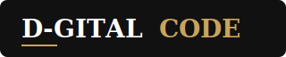
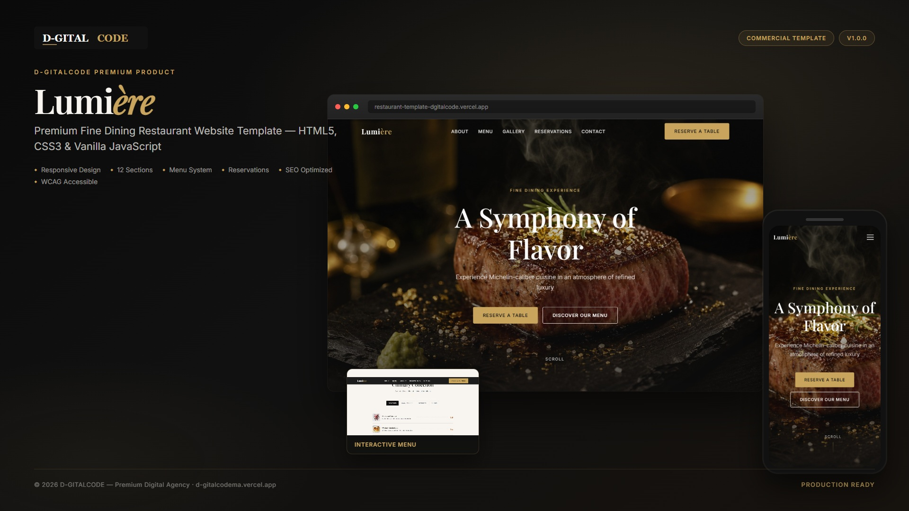
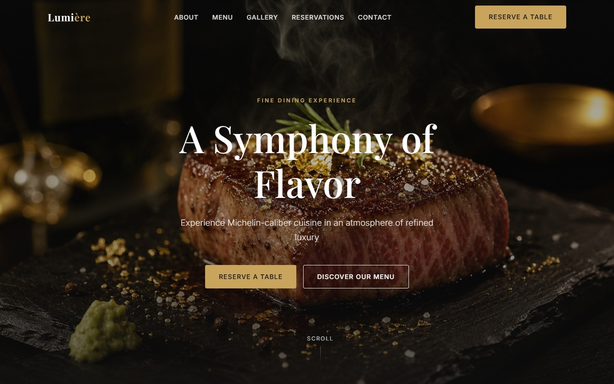
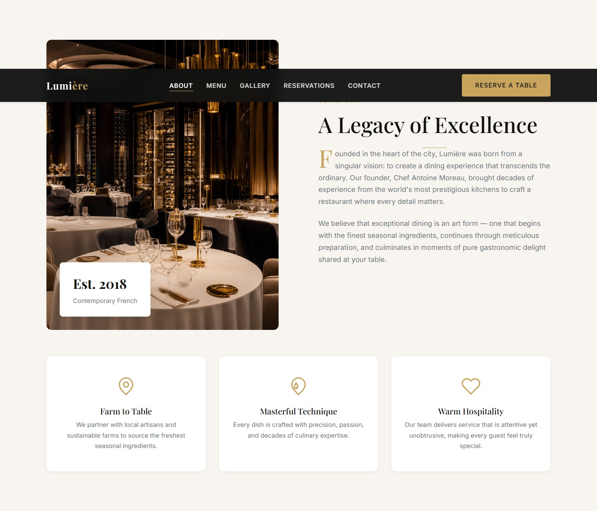
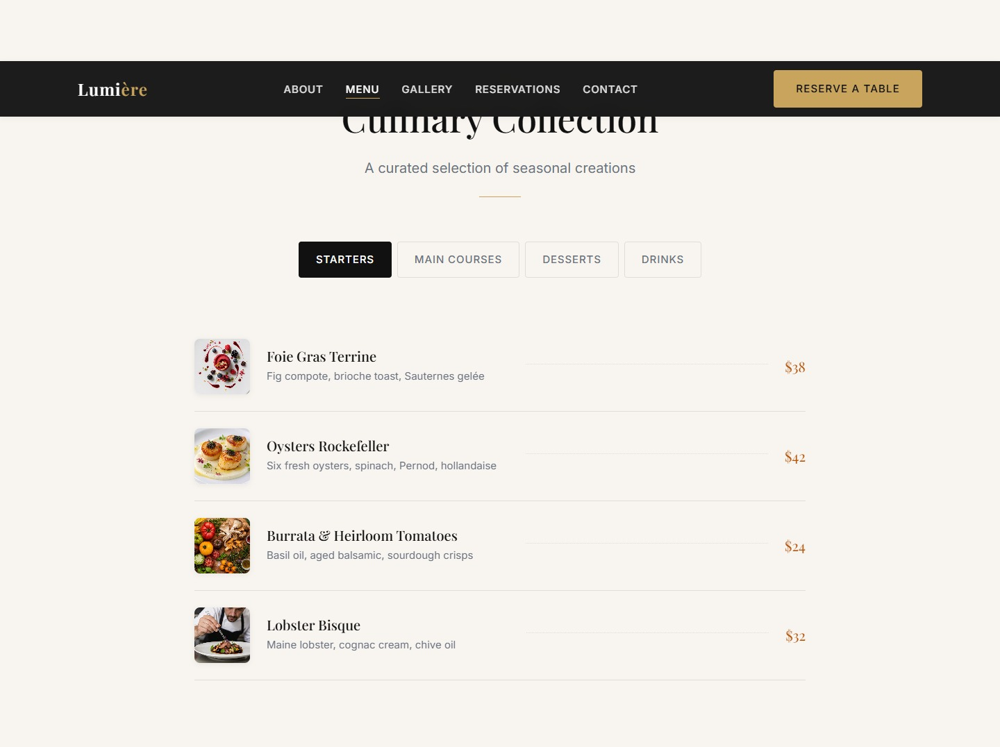
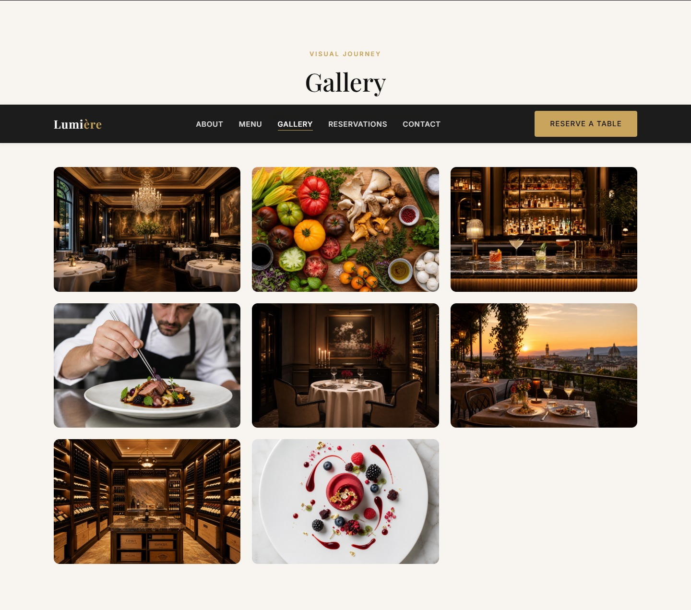
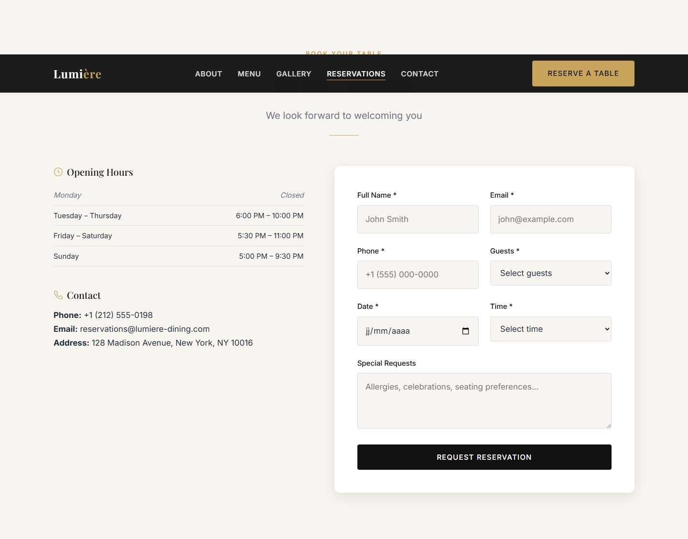
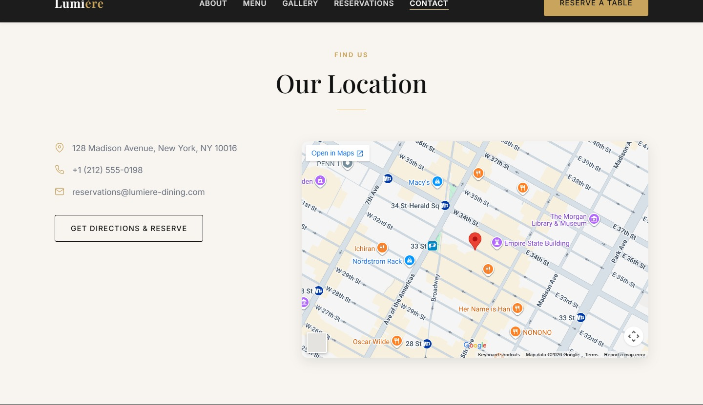
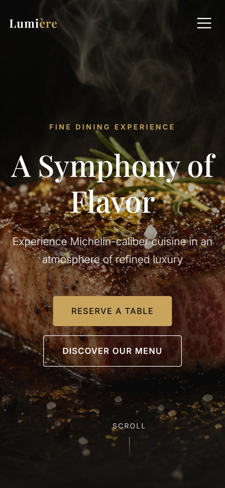

<p align="center">
  <a href="https://d-gitalcodema.vercel.app/" target="_blank" rel="noopener noreferrer">
    
  </a>
</p>

<p align="center">
  <a href="https://d-gitalcodema.vercel.app/" target="_blank" rel="noopener noreferrer"><strong>D-GITALCODE</strong></a>
  &nbsp;·&nbsp; Premium Digital Agency
  &nbsp;·&nbsp; <a href="https://d-gitalcodema.vercel.app/" target="_blank" rel="noopener noreferrer">d-gitalcodema.vercel.app</a>
</p>

<h1 align="center">Lumière — Premium Restaurant Website Template</h1>

<p align="center">
  <strong>A luxury fine dining website template crafted for restaurant owners, agencies, and digital professionals who demand excellence.</strong>
</p>

<p align="center">
  <em>Elegance · Appetite · Trust · Hospitality · Conversion</em>
</p>

<p align="center">
  <a href="https://github.com/dgitalcode/restaurant-template/releases"></a>
  <a href="LICENSE"></a>
  
  
  
  
  
</p>

<p align="center">
  <a href="https://restaurant-template-dgitalcode.vercel.app/" target="_blank" rel="noopener noreferrer"><strong>View Live Demo</strong></a>
  &nbsp;·&nbsp;
  <a href="https://d-gitalcodema.vercel.app/" target="_blank" rel="noopener noreferrer"><strong>D-GITALCODE</strong></a>
  &nbsp;·&nbsp;
  <a href="#-installation">Quick Start</a>
  &nbsp;·&nbsp;
  <a href="#-features">Features</a>
  &nbsp;·&nbsp;
  <a href="#-customization-guide">Customize</a>
  &nbsp;·&nbsp;
  <a href="https://github.com/dgitalcode/restaurant-template/issues">Report Issue</a>
</p>

---

<br />

<p align="center">
  
</p>

<p align="center">
  <sub><strong>Lumière</strong> by D-GITALCODE — Premium fine dining website template · Commercial ready</sub>
</p>

<br />

## 🍽️ Project Overview

**Lumière** is a **single-restaurant, commercial-grade website template** designed and engineered by **[D-GITALCODE](https://d-gitalcodema.vercel.app/)** — a premium digital agency specializing in high-end web experiences.

This is **not** a restaurant directory, food delivery platform, reservation marketplace, or multi-restaurant SaaS. It is **one complete, luxury website** ready to be sold, customized, and deployed for individual restaurant brands worldwide.

### Purpose

Deliver a **Michelin-caliber digital presence** that communicates luxury, appetite, trust, freshness, quality, elegance, hospitality, and professionalism — inspired by the world's finest dining establishments.

### Target Audience

| Audience | Use Case |
|----------|----------|
| **Fine Dining Restaurants** | Launch a premium online presence instantly |
| **Steakhouse & Bistro Owners** | Showcase menu, chef, and reservations |
| **Hotel & Resort Restaurants** | Elegant brand storytelling and booking flow |
| **Web Agencies & Freelancers** | White-label client delivery with minimal setup |
| **Template Marketplaces** | Commercial product ready for distribution |

### Commercial Value

- **Zero framework dependency** — no React, Vue, or build tools required
- **Fully editable** — logo, images, menu, contact, colors, and copy
- **Portfolio-ready** — professional documentation and screenshot structure included
- **Client-ready** — deploy to any static host in minutes
- **Agency-grade quality** — designed to command premium pricing

### Customization Possibilities

Buyers can effortlessly replace:

- Logo & restaurant name  
- All photography & dish imagery  
- Menu items, categories & pricing  
- Contact details & opening hours  
- Social media links & map location  
- Color palette & typography tokens  
- Reservation & newsletter form endpoints  

---

## 🌐 Restaurant Template Live Demo

Experience the fully deployed Lumière template in your browser:

<p align="center">
  <a href="https://restaurant-template-dgitalcode.vercel.app/" target="_blank" rel="noopener noreferrer">
    
  </a>
</p>

<p align="center">
  <strong><a href="https://restaurant-template-dgitalcode.vercel.app/" target="_blank" rel="noopener noreferrer">https://restaurant-template-dgitalcode.vercel.app/</a></strong>
</p>

<table align="center">
  <tr>
    <td align="center" width="50%">
      <h3>🚀 Live Preview</h3>
      <a href="https://restaurant-template-dgitalcode.vercel.app/" target="_blank" rel="noopener noreferrer">
        <strong>Open Live Demo →</strong>
      </a>
      <br /><br />
      <sub>Production deployment on <strong>Vercel</strong> · Hosted by <a href="https://d-gitalcodema.vercel.app/" target="_blank" rel="noopener noreferrer"><strong>D-GITALCODE</strong></a></sub>
    </td>
    <td align="center" width="50%">
      <h3>💻 Local Preview</h3>
      <pre>git clone https://github.com/dgitalcode/restaurant-template.git
cd restaurant-template
python -m http.server 8080</pre>
      <sub>Then open <strong>http://localhost:8080</strong></sub>
    </td>
  </tr>
</table>

---

## 🏢 About D-GITALCODE

<p align="center">
  <a href="https://d-gitalcodema.vercel.app/" target="_blank" rel="noopener noreferrer">
    
  </a>
</p>

**[D-GITALCODE](https://d-gitalcodema.vercel.app/)** is a premium digital agency that transforms ambitious brands into high-performing digital experiences. We combine senior engineering, luxury UI/UX design, and conversion-focused strategy to deliver products that inspire trust and drive results.

### Official Website

🔗 **[https://d-gitalcodema.vercel.app/](https://d-gitalcodema.vercel.app/)**

<p align="center">
  <a href="https://d-gitalcodema.vercel.app/" target="_blank" rel="noopener noreferrer">
    
  </a>
</p>

### Our Expertise

| Service | Description |
|---------|-------------|
| **Web Development** | Modern, scalable websites and web applications |
| **Mobile Applications** | iOS & Android apps with premium UX |
| **UI/UX Design** | Conversion-oriented interfaces and design systems |
| **Business Websites** | Professional sites for brands that demand excellence |
| **Digital Solutions** | E-commerce, automation, SEO, and end-to-end digital strategy |

> *50+ projects delivered · 30+ satisfied clients · 8+ years of experience*

This restaurant template reflects the same standards we apply to every D-GITALCODE product: **performance, elegance, accessibility, and commercial readiness.**

---

## ✨ Features

<table>
  <tr>
    <td width="50%" valign="top">

### Design & Experience
- ✅ **Responsive Design** — Mobile-first, flawless on every device
- ✅ **Premium UI/UX** — Luxury editorial layout & spacing system
- ✅ **Smooth Animations** — Reveal effects, parallax, elegant hovers
- ✅ **12 Complete Sections** — Full restaurant website out of the box

### Restaurant-Specific
- ✅ **Signature Dishes** — Premium dish cards with imagery
- ✅ **Full Menu System** — Tabbed categories with dish thumbnails
- ✅ **Chef Showcase** — Authority-building chef profile section
- ✅ **Masonry Gallery** — Lightbox with keyboard navigation
- ✅ **Reservation Section** — Booking form UI with validation
- ✅ **Contact & Location** — Map embed, hours, and details

    </td>
    <td width="50%" valign="top">

### Technical Excellence
- ✅ **SEO Optimization** — Meta tags, Open Graph, JSON-LD schema
- ✅ **Accessibility** — WCAG 2.1 AA target, ARIA, skip links
- ✅ **Performance Optimized** — Lazy loading, modular CSS/JS
- ✅ **Zero Dependencies** — Pure HTML5, CSS3, Vanilla JavaScript
- ✅ **Semantic HTML** — Clean, maintainable, future-proof markup
- ✅ **Commercial Documentation** — README, LICENSE, guides included

    </td>
  </tr>
</table>

---

## 🛠️ Technology Stack

<p align="center">
  
  
  
  
  
</p>

| Layer | Technology | Details |
|-------|------------|---------|
| **Markup** | HTML5 | Semantic sections, structured data, accessibility landmarks |
| **Styling** | CSS3 | Custom properties, Grid, Flexbox, mobile-first breakpoints |
| **Scripting** | Vanilla JavaScript | ES6 modules — navigation, gallery, forms, animations |
| **Typography** | Google Fonts | Playfair Display (headings) + Inter (body) |
| **Icons** | Inline SVG | Lightweight, scalable, no icon library required |

> **No frameworks. No build step. No npm install.** Open, customize, deploy.

---

## 📸 Screenshots

<p align="center"><strong>Real captures from the live Lumière template — no stock imagery</strong></p>

<p align="center">
  <sub>All previews below are captured directly from the running website at <a href="https://restaurant-template-dgitalcode.vercel.app/" target="_blank" rel="noopener noreferrer">restaurant-template-dgitalcode.vercel.app</a></sub>
</p>

<br />

### Product Cover

<p align="center">
  
</p>
<p align="center"><sub>Premium product cover · D-GITALCODE branding · Real template mockups · Commercial presentation ready</sub></p>

<br />

### Hero Section

<p align="center">
  
</p>
<p align="center"><sub>Fullscreen cinematic hero · Dual CTAs · Soft parallax · Premium typography</sub></p>

<br />

### About Section

<p align="center">
  
</p>
<p align="center"><sub>Split editorial layout · Brand philosophy · Drop-cap storytelling</sub></p>

<br />

<table>
  <tr>
    <td width="50%" align="center">
      <strong>Menu Section</strong><br /><br />
      
      <br /><sub>Tabbed categories · Dish thumbnails · Elegant price layout</sub>
    </td>
    <td width="50%" align="center">
      <strong>Gallery Section</strong><br /><br />
      
      <br /><sub>Masonry grid · Lightbox · Keyboard navigation</sub>
    </td>
  </tr>
</table>

<br />

<table>
  <tr>
    <td width="50%" align="center">
      <strong>Reservation Section</strong><br /><br />
      
      <br /><sub>Booking form · Opening hours · Contact details</sub>
    </td>
    <td width="50%" align="center">
      <strong>Contact Section</strong><br /><br />
      
      <br /><sub>Google Maps embed · Address · Hours &amp; contact info</sub>
    </td>
  </tr>
</table>

<br />

### Mobile View

<p align="center">
  
</p>
<p align="center"><sub>Mobile-first · Touch-friendly · Fully responsive at 390px viewport</sub></p>

<br />

<p align="center">
  <sub>To regenerate screenshots locally: <code>npm run screenshots</code> (requires Google Chrome)</sub>
</p>

---

## 🚀 Installation

### Prerequisites

- A modern web browser (Chrome, Firefox, Safari, Edge)
- A local web server (required for ES modules)
- Git (optional, for cloning)

### Step 1 — Get the Template

**Option A: Clone via Git**
```bash
git clone https://github.com/dgitalcode/restaurant-template.git
cd restaurant-template
```

**Option B: Download ZIP**  
Visit [github.com/dgitalcode/restaurant-template](https://github.com/dgitalcode/restaurant-template) → **Code** → **Download ZIP**

### Step 2 — Start a Local Server

Choose any method:

```bash
# Python 3
python -m http.server 8080

# Node.js
npx serve .

# PHP
php -S localhost:8080
```

### Step 3 — Open in Browser

Navigate to **http://localhost:8080**

### Step 4 — Deploy to Production

| Platform | Method |
|----------|--------|
| **Vercel** | Import GitHub repository or `npx vercel --prod` |
| **Netlify** | Drag & drop folder or connect GitHub repo |
| **GitHub Pages** | Settings → Pages → Source: `main` branch, `/ (root)` |
| **Traditional Hosting** | Upload files via FTP to `public_html` |

> No build step or compilation required.

---

## 🎨 Customization Guide

Everything is designed for **fast, non-technical customization** by restaurant owners and agencies.

### 1. Change Logo & Restaurant Name

Open `index.html` and search for `<!-- EDIT:` comments:

```html
<!-- Header logo -->
<a href="#" class="header__logo">Your<span>Brand</span></a>

<!-- Page title -->
<title>Your Restaurant — Fine Dining</title>
```

Replace the text logo with an image if preferred:

```html
<a href="#" class="header__logo">
  
</a>
```

### 2. Replace Images

Drop your images into `assets/images/` and update paths in `index.html`:

| File | Purpose |
|------|---------|
| `hero.jpg` | Fullscreen hero background |
| `about.jpg` | About section |
| `chef.jpg` | Chef showcase |
| `dish-*.jpg` | Signature dishes & menu thumbnails |
| `gallery-*.jpg` | Gallery masonry grid |

**Recommended sizes:** Hero 1920×1080 · Dishes 600×450 · Gallery 600×400+

### 3. Update Menu Items

Edit the `#menu` section in `index.html`. Each item supports a thumbnail:

```html
<div class="menu-item">
  <div class="menu-item__thumb">
    
  </div>
  <div class="menu-item__info">
    <h3 class="menu-item__name">Your Dish</h3>
    <p class="menu-item__desc">Description here</p>
  </div>
  <span class="menu-item__price">$48</span>
</div>
```

Reference data structure: `js/config.js`

### 4. Update Contact Information

Search for `<!-- EDIT: Contact Details -->` and `<!-- EDIT: Opening Hours -->` in `index.html`.

Update the Google Maps iframe in the `#contact` section with your embed URL.

### 5. Modify Colors

Edit design tokens in `css/variables.css`:

```css
:root {
  --color-primary: #111111;      /* Dark luxury base */
  --color-secondary: #C8A45D;    /* Gold accent */
  --color-background: #F8F5F0;    /* Warm cream */
  --color-text: #1F2937;         /* Body text */
  --color-accent: #B45309;       /* Price highlights */
}
```

### 6. Connect Forms (Production)

Reservation and newsletter forms use client-side validation. For production, connect to:

- [Formspree](https://formspree.io/)
- [Netlify Forms](https://docs.netlify.com/forms/setup/)
- Your custom backend API

See `docs/CUSTOMIZATION.md` for extended instructions.

---

## 📁 Folder Structure

```
restaurant-template/
│
├── 📄 index.html                 # Main website — all 12 sections
├── 📄 robots.txt                 # SEO crawler directives
├── 📄 LICENSE                    # MIT + commercial terms
├── 📄 README.md                  # This file
│
├── 📂 css/
│   ├── main.css                  # CSS entry point
│   ├── variables.css             # Design tokens & color palette
│   ├── reset.css                 # Base reset & typography
│   ├── layout.css                # Grid & section layout
│   ├── components.css            # UI components & menu styles
│   └── animations.css            # Motion & transitions
│
├── 📂 js/
│   ├── main.js                   # Application bootstrap
│   ├── config.js                 # Centralized content reference
│   ├── navigation.js             # Header, scroll, mobile menu
│   ├── gallery.js                # Masonry lightbox
│   ├── form.js                     # Forms & menu tabs
│   └── animations.js             # Scroll reveal & parallax
│
├── 📂 assets/
│   └── images/                   # All template photography
│       ├── hero.jpg
│       ├── about.jpg
│       ├── chef.jpg
│       ├── dish-*.jpg
│       ├── gallery-*.jpg
│       └── favicon.svg
│
├── 📂 docs/
│   ├── CUSTOMIZATION.md          # Extended customization guide
│   ├── assets/
│   │   └── d-gitalcode-logo.svg  # Brand logo
│   └── screenshots/              # Real website captures & product cover
│       ├── cover.jpg             # Premium D-GITALCODE product cover
│       ├── hero-section.jpg
│       ├── about-section.jpg
│       ├── menu-section.jpg
│       ├── gallery-section.jpg
│       ├── reservation-section.jpg
│       ├── contact-section.jpg
│       └── mobile-version.jpg
│
├── 📂 scripts/
│   ├── capture-screenshots.mjs   # Automated screenshot capture
│   └── cover-template.html       # Product cover layout template
│
└── 📂 screenshots/               # Capture guide for marketplace listings
    └── README.md
```

---

## ⚡ Performance & Quality

<p align="center">
  
  
  
  
</p>

| Metric | Target | Implementation |
|--------|--------|----------------|
| **Lighthouse Performance** | 95+ | Lazy loading, modular assets, zero framework overhead |
| **SEO Score** | 95+ | Semantic HTML, meta tags, Open Graph, JSON-LD schema |
| **Accessibility** | 95+ | ARIA labels, skip links, keyboard nav, reduced motion |
| **Responsive** | 100% | Mobile-first CSS Grid, tested 320px → 1440px+ |
| **Best Practices** | 95+ | No inline scripts, passive listeners, modern standards |

### Production Recommendations

- Compress images to **WebP/AVIF** before launch  
- Enable **gzip/brotli** compression on your server  
- Set **cache headers** for static assets  
- Connect forms to a **secure backend**  

---

## 📜 Commercial License

This template is released under the **[MIT License](LICENSE)** with a **Commercial Use Notice**.

| Permission | Detail |
|------------|--------|
| ✅ **Client Projects** | Use for unlimited restaurant client websites |
| ✅ **Modification** | Customize freely for end clients |
| ✅ **Deployment** | Deploy to any hosting platform |
| ❌ **Redistribution** | Resale of source files prohibited without written permission |

For extended licensing, white-label, or marketplace partnerships:

📧 Contact **[D-GITALCODE](https://d-gitalcodema.vercel.app/)**

Full license text: **[LICENSE](LICENSE)**

---

## 📞 Contact

<p align="center">
  <a href="https://d-gitalcodema.vercel.app/" target="_blank" rel="noopener noreferrer">
    
  </a>
</p>

<p align="center">
  <strong>Premium digital products & agency services by <a href="https://d-gitalcodema.vercel.app/" target="_blank" rel="noopener noreferrer">D-GITALCODE</a></strong>
</p>

<p align="center">
  🌐 <strong>Website:</strong> <a href="https://d-gitalcodema.vercel.app/" target="_blank" rel="noopener noreferrer">https://d-gitalcodema.vercel.app/</a><br />
  🚀 <strong>Live Demo:</strong> <a href="https://restaurant-template-dgitalcode.vercel.app/" target="_blank" rel="noopener noreferrer">https://restaurant-template-dgitalcode.vercel.app/</a><br />
  🐙 <strong>GitHub:</strong> <a href="https://github.com/dgitalcode" target="_blank" rel="noopener noreferrer">https://github.com/dgitalcode</a><br />
  📦 <strong>Repository:</strong> <a href="https://github.com/dgitalcode/restaurant-template" target="_blank" rel="noopener noreferrer">https://github.com/dgitalcode/restaurant-template</a>
</p>

<p align="center">
  <a href="https://d-gitalcodema.vercel.app/"></a>
  <a href="https://github.com/dgitalcode/restaurant-template"></a>
</p>

---

## 🏁 Footer — D-GITALCODE

<p align="center">
  <a href="https://d-gitalcodema.vercel.app/" target="_blank" rel="noopener noreferrer">
    
  </a>
</p>

<p align="center">
  <strong><a href="https://d-gitalcodema.vercel.app/" target="_blank" rel="noopener noreferrer">D-GITALCODE</a></strong> — Premium digital agency · Web · Mobile · UI/UX · Business Websites
</p>

<p align="center">
  🌐 <a href="https://d-gitalcodema.vercel.app/" target="_blank" rel="noopener noreferrer"><strong>https://d-gitalcodema.vercel.app/</strong></a>
</p>

---

<p align="center">
  <sub>
    <strong>Lumière Restaurant Template</strong> · Version 1.0.0<br />
    Live Demo · <a href="https://restaurant-template-dgitalcode.vercel.app/" target="_blank" rel="noopener noreferrer"><strong>restaurant-template-dgitalcode.vercel.app</strong></a><br />
    Crafted with precision by <a href="https://d-gitalcodema.vercel.app/"><strong>D-GITALCODE</strong></a><br />
    Copyright © 2026 D-GITALCODE. All rights reserved.
  </sub>
</p>

<p align="center">
  <sub>If this template helped your project, consider giving it a ⭐ on GitHub.</sub>
</p>
